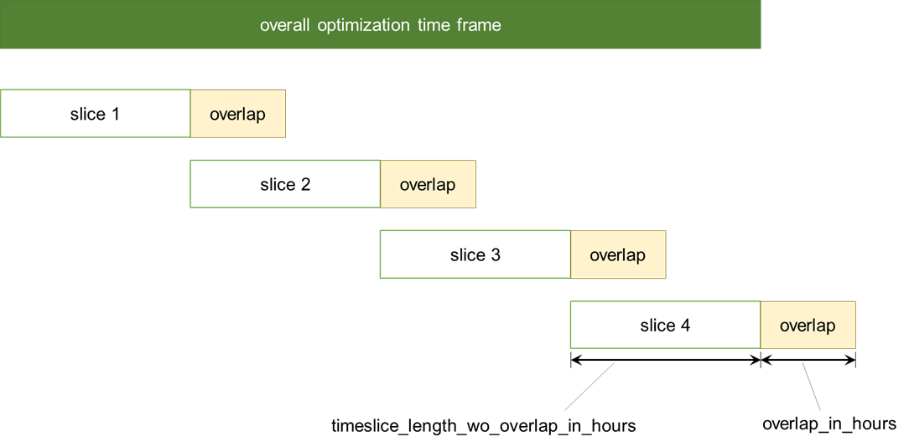

.. _background:

Background
----------

.. _economics:

Energy-economic background
++++++++++++++++++++++++++
Feel free to skip this section if you are familiar with power markets design
as well as fundamental bottom-up power market modeling.

Our model in a way abstracts from the real market constellations and assumes
all plant operators to receive revenues solely from the day-ahead market and
to bid into this market. We in turn do not explicitly
model power plant operators' (or other traders') bidding behaviour, but assume them to offer their
capacities at their marginal costs in a perfectly competitive
**quasi day-ahead market** in order
to serve an inflexible and exogenously given demand. We also include power storages and demand
response. The latter enables parts of the demand to adjust in a flexible manner.
Thus, the aggregated power plants' capacities which are sorted by their marginal costs
result in a merit order that is similar to the aggregated supply curves in
the real day-ahead auction procedure in competitive power markets.

The perspective of our model is to assume that there is a "social planner"
optimizing the power system in terms of minimizing its overall (investment and dispatch) costs
under the prevalent constraints, such as demand coverage or power plants capacity limits.
We assume this social planner to have **perfect foresight** over the entire
optimization time frame. We offer a :ref:`myopic-horizon` to break with
this assumption. Our basic approach is quite common
for **fundamental bottom-up modeling** of power systems
since using a sound model parameterization, it enables the modeler
to produce close to reality dispatch and price results in a highly
simplified modeling setting with quite large system boundaries.

What is more, is that power markets in Europe are **interconnected** and operated
within (mostly national) bidding zones. We model the German neighboring countries
and their power plants in a rather aggregated manner in order to improve our
day-ahead price prognosis and the dispatch result for Germany.

In order to improve our model results, we account for some **power system inflexibilities**
that lead to a deviation from the cost optimum and are expressed by introducing
additional constraints (such as minimum load profiles for CHP power plants
that are empirically derived to serve heat demands)
or adjusting parameter values (such as the overall
capacities of coal power plants that has not been fully made use of).

.. _granularity:

Model granularity
+++++++++++++++++

* Technical granularity:

For Germany, **conventional power plants** are modelled with more detail. We group
them by technology and energy carrier and cluster by efficiency whereby we end up
with an amount of clusters that is around 10% of the number of individual blocks.
Note that this can be flexibly adjusted in ``pommesdata``. We choose this approach
in favor of keeping a detailed time resolution, as ``pommesinvest`` has been first
applied to study demand response potentials, i.e. a short-term flexibility source,
thus requiring a high temporal resolution (see below).
**Storages** are aggregated to one cluster per technology.
**Renewable energy sources (RES)** units are clustered per energy carrier as well.
For the neigbouring countries which have interconnections with Germany,
we consider one cluster per technology.

The following fuels and technologies are considered by default:

.. csv-table:: Renewable technologies
    :header: "fuel", "technologies"

    "Solar", "solar PV plants"
    "Wind onshore", "wind onshore plants"
    "Wind offshore", "wind offshore plants"
    "Run of River", "run of river plants"
    "Biomass", "solid biomass ST, biogas GT, biogas ST, biogas M"

.. csv-table:: Existing conventional / backup technologies
    :header: "fuel", "technologies"

    "Uranium", "Nuclear ST"
    "Lignite", "Lignite ST"
    "Hard coal", "Hard coal ST"
    "Natural gas", "Natural gas CC, natural gas GT, natural gas M"
    "Oil", "Oil CC, oil GT"
    "waste / mixed / other fossils", "other CC, other GT, other M"

All conventionals and backup plants as well as biomass plants may optionally
be combined heat and power (CHP) or industrial power plant (IPP). This
alters their minimum output profile.

.. csv-table:: Existing storage technologies
    :header: "energy source", "technologies"

    "electricity", "pumped hydro energy storage"
    "electricity", "reservoir energy storage"

Existing conventional plants are phased out either after reaching their
technical lifetime or according to administrative plans (e.g. for coal phase out).
In contrast, existing storage units are assumed to remain in the system and be
retrofitted in case needed.

For Germany, the expansion pathway for renewable energies is given exogenous,
based on current plans according to the German Renewable Energies Act (EEG 2023).
For other European countries, capacity development is completely model-exogenous
and in turn, only the dispatch is optimized.

For Germany, we introduce the following backup technologies that can be invested into:

.. csv-table:: Backup technologies eligible to be invested into
    :header: "fuel", "technologies"

    "Natural gas", "Natural gas CC, natural gas GT"
    "Hydrogen", "Hydrogen CC, hydrogen GT, hydrogen FC"
    "Oil", "Oil GT (peaking unit)"
    "Biomass", "Biomass ST"
    "Waste", "ST"

In addition, the model may invest into hydrogen electrolyzers used to provide
hydrogen for the power sector. Note that the hydrogen demand of other sectors
is out of scope and thus, hydrogen demand is comparatively small as are invested
capacities.

The following storage technologies can be invested into:

.. csv-table:: Storage technologies eligible to be invested into
    :header: "energy source", "technologies"

    "electricity", "pumped hydro energy storage"
    "electricity", "battery energy storage (mix dominated by Li-Ion)"

In an upfront meta-analysis on technical demand response potentials, techno-economic
data on these have been collected and demand response units have been grouped
by sector and clustered by costs as well as shifting durations, ending up in
the following clusters which can also be invested into:

.. csv-table:: Demand response clusters eligible to be invested into
    :header: "name", "technologies"
    :widths: 20, 80

    "households, shifting only", "refridgerators, dishwashers, tumble dryers, washing machines, freezers, fridge-and-freezer combination"
    "households, shifting & shedding", "Heat circulation pumps"
    "industry, shifting only", "mechanical and chemical wood pulp, paper machines, paper recycling, air separation units, ventilation, process cold, climate cold, compressed air"
    "industry, shedding only", "electric arc steel-making"
    "industry, shifting & shedding", "Chlor-alkali electrolysis, Primary aluminium electrolysis, cement mills, copper and zinc electrolysis, foundries (arc furnace), calcium carbide production (arc furnace), Cooling (food industry)"
    "commerce, shifting only", "Process cold, ventilation, lighting, process heat, pumps in drinking water supply, crushers (recycling industry), cold stores, process cold (retailing industry)"
    "commerce & households, shifting only", "heat pumps, night storage heating, hot water supply, climate cold (air conditioning)"

*Abbreviations:*

- BESS: battery energy storage systems
- CC: combined cycle (gas turbine)
- CHP: combined heat and power
- GT: gas turbine
- IPP: industry power plants
- M: combustion engine (German: "Motor")
- PV: photovoltaics
- RES: renewable energy sources
- ST: steam turbine
- FC: fuel cell

* Temporal granularity:

The default model resolution is **hourly** due to the resolution of the given
time series inputs, either as an integral optimization run for all hours of
a year (or another simulation time frame) or using a :ref:`myopic-horizon`.
Other allowed resolutions are 4 hours, 8 hours, 24 hours, 36 hours or 48 hours.
Time series are resampled according to the chosen model frequency.

* Spatial granularity:

There is one spatial node **per bidding zone for Germany and its 10 electric neighbors plut Italy**,
thus representing real market area boundaries and processes without taking network congestions
within bidding zones into account, also not considering changed bidding zones over time.

The following countries and bidding zones are considered by default:

.. csv-table::
    :header: "country code", "country", "bidding zone(s)"

    "AT", "Austria", "AT"
    "BE", "Belgium", "BE"
    "CH", "Switzerland", "CH"
    "CZ", "Czech Republic", "CZ"
    "DE", "Germany", "DE-LU"
    "DK", "Denmark", "DK1, DK2"
    "FR", "France", "FR"
    "NL", "Netherlands", "NL"
    "NO", "Norway", "NO1, NO2, NO3, NO4, NO5"
    "PL", "Poland", "PL"
    "SE", "Sweden", "SE1, SE2, SE3, SE4"
    "IT", "Italy", "IT (aggregated into single zone)"

.. _maths:

Mathematical background
+++++++++++++++++++++++
Feel free to skip this section if you are familiar with fundamental
bottom-up power market modeling using a linear programming approach.

From a mathematical point of view, our model is formulated as a linear program
with the following characteristics:

- goal: Minimize total power system costs
- constraints:
    - demand coverage
    - power plants constraints: capacity limits, minimum load constraints
    - storage constraints: power limits, energy limits, storage losses, storage transition
    - demand response constraints: power limits, energy limits, time restrictions
    - constraints for interconnection: power limits, transmission losses
    - emissions pathway constraint (budget possible as well)

Fixed time series, such as the demand time series or the fixed renewable infeed,
as well as scalar values we read in, are provided as parameters from a mathematical point of view.

Our model has a block-angular structure since the constraint formulations and
objective terms are encapsulated in the components definitions of oemof.solph.
Thus, in general decomposition techniques could be applied to speed up computation.

The model formulation ends in a sparse matrix. The complexity of the model is
determined by the :ref:`granularity` which may be altered. The model statistics
for the default granularity used are summarized in the table below
(26 years in hourly resolution optimization time frame):

* Without demand response (after presolve using CPLEX solver)

======== ===========
element  No.
======== ===========
rows     20,345,369
columns  78,374,661
nonzeros 141,634,644
======== ===========

* With demand response (after presolve using CPLEX solver)

======== ===========
element  No.
======== ===========
rows     30,013,996
columns  94,454,438
nonzeros 287,561,670
======== ===========

For the mathematical formulation, please see :ref:`formulas`.
You may also refer to the
`oemof.solph API reference <https://oemof-solph.readthedocs.io/en/latest/reference/oemof.solph.html>`_
for a documentation of the constraints and objective terms introduced
with the individual components.

.. _techs:

Technical background
++++++++++++++++++++
``pommesinvest`` builds on the framework `oemof.solph <https://github.com/oemof/oemof-solph>`_
which allows modeling energy systems in a graph-based representation
with the underlying mathematical constraints and objective function terms
implemented in `pyomo <https://pyomo.readthedocs.io/en/stable/>`_.
Some of the required oemof.solph features - such as multi-period modelling and demand response modeling -
have been provided by the *POMMES* main developers which are also active in
the oemof community.
Users not familiar with oemof.solph may find further information
in the `oemof.solph documentation <https://oemof-solph.readthedocs.io/en/latest/readme.html>`_.

We use the following components from the ``oemof.solph`` framework in order
to represent the following units of the power system:

- Transformer: (conventional) power plants, interconnectors to other bidding zones
- Source: commodity sources, fixed renewable units infeed
- Sink: national electricity demands
- GenericStorage: electricity storage units (pumped storage and reservoir)
- Buses: Elements to connect all power resp. energy flows
- SinkDSM: Flexible demand sinks to respresent demand response

.. _myopic-horizon:

Myopic horizon approach
++++++++++++++++++++++++

.. warning::
    * Note that the myopic horizon approach is not functional.
    * It has been kept throughout the development, but is no longer maintained.
    * Feel free to re-integrate it. We can assist you with that.

A myopic horizon approach can be used for multiple use cases, e.g.

- to force a break with the perfect foresight paradigm and to model imperfect
  foresight
- to reduce model complexity and ensure model solvability.

The idea is to slice your overall optimization time frame
into shorter horizons and thus loose the perfect foresight assumption
as well as the global optimum over the entire simulation time frame.
In order to prevent storage units from being emptied at the end of each
time slice, an overlap should be defined. I.e., only parts of the next
time slice are used while the overlap is dropped.

The following figure explains the basic idea. Note that it is also referred
to as a rolling horizon when rather considering the short-term dispatch time frame.

*Image based on Büllesbach (2018), p. 62 and Marquant et al. (2015), p. 2141*

The model results are then obtained by concatenating the results for the individual
time slices. There is a rolling horizon implementation integrated as an
alternative to a perfect foresight simulation in ``pommesdispatch``, see
:ref:`using`.

References
++++++++++
Büllesbach, Fabian (2018): Simulation von Stromspeichertechnologien
in regionaler und technischer Differenzierung.
Freie wissenschaftliche Arbeit zur Erlangung des Grades eines
Master of Science am Fachgebiet Energie- und Ressourcenmanagement der TU Berlin.

Marquant, Julien F. ; Evins, Ralph and Carmeliet, Jan (2015): Reducing
Computation Time with a Rolling Horizon Approach Applied to a MILP Formulation
of Multiple Urban Energy Hub System. In: Procedia Computer Science 51 (2015),
S. 2137–2146. – ISSN 18770509.